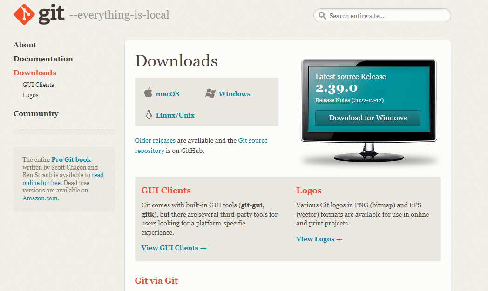
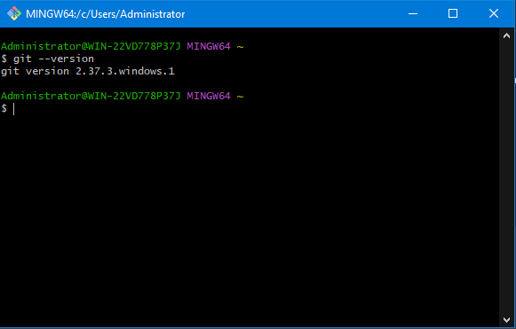

# Git Instalation

## Langkah-Langkah Yang Harus Kalian Lakukan Adalah :

### 1. Mendownload Git Bash

  

)

### 2. Cek Versi Git Dengan Cara Buka Git Bash Kamu, Dan Tulis git --version

  

### 3. Selamat Git Sudah Terinstall Di PC Kalian, Waktunya Memulai Upload Project Kalian Menggunakan Github
