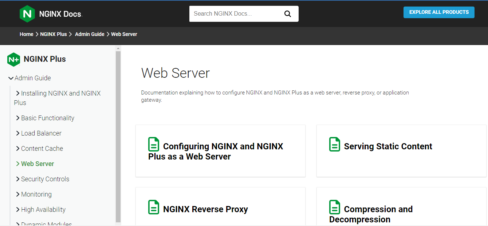

Deploying NGINX and NGINX Plus on Docker
Deploy NGINX and NGINX Plus as the Docker container.

NGINX Plus, the high‑performance application delivery platform, load balancer, and web server, is available as the Docker container.

Prerequisites
Docker installation
Docker Hub account (NGINX Open Source)
nginx-repo.crt and nginx-repo.key files, Dockerfile for Docker image creation (NGINX Plus)

Running NGINX Open Source in a Docker Container
You can create an NGINX instance in a Docker container using the NGINX Open Source image from the Docker Hub.

Launch an instance of NGINX running in a container and using the default NGINX configuration with the following command:

$ docker run --name mynginx1 -p 80:80 -d nginx
where:

mynginx1 is the name of the created container based on the NGINX image

the -d option specifies that the container runs in detached mode: the container continues to run until stopped but does not respond to commands run on the command line.

the -p option tells Docker to map the ports exposed in the container by the NGINX image (port 80) to the specified port on the Docker host. The first parameter specifies the port in the Docker host, the second parameter is mapped to the port exposed in the container

The command returns the long form of the container ID: fcd1fb01b14557c7c9d991238f2558ae2704d129cf9fb97bb4fadf673a58580d. This form of ID is used in the name of log files.

Verify that the container was created and is running with the docker ps command:

$ docker ps
CONTAINER ID IMAGE COMMAND CREATED STATUS ...  
fcd1fb01b145 nginx:latest "nginx -g 'daemon of 16 seconds ago Up 15 seconds ...

    ... PORTS              NAMES
    ... 0.0.0.0:80->80/tcp mynginx1

This command also allows viewing the port mappings set in the previous step: the PORTS field in the output reports that port 80 on the Docker host is mapped to port 80 in the container.

Running NGINX Plus in a Docker Container
Docker can also be used with NGINX Plus. The difference between using Docker with NGINX Open Source is that you first need to create an NGINX Plus image, because as a commercial offering NGINX Plus is not available at Docker Hub.

Note: Never upload your NGINX Plus images to a public repository such as Docker Hub. Doing so violates your license agreement.

Creating NGINX Plus Docker Image
To generate an NGINX Plus image:

Create the Docker build context, or a Dockerfile:

FROM debian:bullseye-slim

LABEL maintainer="NGINX Docker Maintainers <docker-maint@nginx.com>"

# Define NGINX versions for NGINX Plus and NGINX Plus modules

# Uncomment this block and the versioned nginxPackages block in the main RUN

# instruction to install a specific release

# ENV NGINX_VERSION 28

# ENV NJS_VERSION 0.7.9

# ENV PKG_RELEASE 1~bullseye

# Download certificate and key from the customer portal (https://account.f5.com)

# and copy to the build context

RUN --mount=type=secret,id=nginx-crt,dst=nginx-repo.crt \
 --mount=type=secret,id=nginx-key,dst=nginx-repo.key \
 set -x \

# Create nginx user/group first, to be consistent throughout Docker variants

    && addgroup --system --gid 101 nginx \
    && adduser --system --disabled-login --ingroup nginx --no-create-home --home /nonexistent --gecos "nginx user" --shell /bin/false --uid 101 nginx \
    && apt-get update \
    && apt-get install --no-install-recommends --no-install-suggests -y \
                        ca-certificates \
                        gnupg1 \
                        lsb-release \
    && \
    NGINX_GPGKEY=573BFD6B3D8FBC641079A6ABABF5BD827BD9BF62; \
    found=''; \
    for server in \
        hkp://keyserver.ubuntu.com:80 \
        pgp.mit.edu \
    ; do \
        echo "Fetching GPG key $NGINX_GPGKEY from $server"; \
        apt-key adv --keyserver "$server" --keyserver-options timeout=10 --recv-keys "$NGINX_GPGKEY" && found=yes && break; \
    done; \
    test -z "$found" && echo >&2 "error: failed to fetch GPG key $NGINX_GPGKEY" && exit 1; \
    apt-get remove --purge --auto-remove -y gnupg1 && rm -rf /var/lib/apt/lists/* \

# Install the latest release of NGINX Plus and/or NGINX Plus modules

# Uncomment individual modules if necessary

# Use versioned packages over defaults to specify a release

    && nginxPackages=" \
        nginx-plus \
        # nginx-plus=${NGINX_VERSION}-${PKG_RELEASE} \
        # nginx-plus-module-xslt \
        # nginx-plus-module-xslt=${NGINX_VERSION}-${PKG_RELEASE} \
        # nginx-plus-module-geoip \
        # nginx-plus-module-geoip=${NGINX_VERSION}-${PKG_RELEASE} \
        # nginx-plus-module-image-filter \
        # nginx-plus-module-image-filter=${NGINX_VERSION}-${PKG_RELEASE} \
        # nginx-plus-module-perl \
        # nginx-plus-module-perl=${NGINX_VERSION}-${PKG_RELEASE} \
        # nginx-plus-module-njs \
        # nginx-plus-module-njs=${NGINX_VERSION}+${NJS_VERSION}-${PKG_RELEASE} \
    " \
    && echo "Acquire::https::pkgs.nginx.com::Verify-Peer \"true\";" > /etc/apt/apt.conf.d/90nginx \
    && echo "Acquire::https::pkgs.nginx.com::Verify-Host \"true\";" >> /etc/apt/apt.conf.d/90nginx \
    && echo "Acquire::https::pkgs.nginx.com::SslCert     \"/etc/ssl/nginx/nginx-repo.crt\";" >> /etc/apt/apt.conf.d/90nginx \
    && echo "Acquire::https::pkgs.nginx.com::SslKey      \"/etc/ssl/nginx/nginx-repo.key\";" >> /etc/apt/apt.conf.d/90nginx \
    && printf "deb https://pkgs.nginx.com/plus/debian `lsb_release -cs` nginx-plus\n" > /etc/apt/sources.list.d/nginx-plus.list \
    && mkdir -p /etc/ssl/nginx \
    && cat nginx-repo.crt > /etc/ssl/nginx/nginx-repo.crt \
    && cat nginx-repo.key > /etc/ssl/nginx/nginx-repo.key \
    && apt-get update \
    && apt-get install --no-install-recommends --no-install-suggests -y \
                        $nginxPackages \
                        curl \
                        gettext-base \
    && apt-get remove --purge -y lsb-release \
    && apt-get remove --purge --auto-remove -y && rm -rf /var/lib/apt/lists/* /etc/apt/sources.list.d/nginx-plus.list \
    && rm -rf /etc/apt/apt.conf.d/90nginx /etc/ssl/nginx \

# Forward request logs to Docker log collector

    && ln -sf /dev/stdout /var/log/nginx/access.log \
    && ln -sf /dev/stderr /var/log/nginx/error.log

EXPOSE 80

STOPSIGNAL SIGQUIT

CMD ["nginx", "-g", "daemon off;"]
view rawDockerfile hosted with ❤ by GitHub
FROM alpine:3.17

LABEL maintainer="NGINX Docker Maintainers <docker-maint@nginx.com>"

# Define NGINX versions for NGINX Plus and NGINX Plus modules

# Uncomment this block and the versioned nginxPackages in the main RUN

# instruction to install a specific release

# ENV NGINX_VERSION 28

# ENV NJS_VERSION 0.7.9

# ENV PKG_RELEASE 1

# Download certificate and key from the customer portal (https://account.f5.com)

# and copy to the build context

RUN --mount=type=secret,id=nginx-crt,dst=cert.pem \
 --mount=type=secret,id=nginx-key,dst=cert.key \
 set -x \

# Create nginx user/group first, to be consistent throughout Docker variants

    && addgroup -g 101 -S nginx \
    && adduser -S -D -H -u 101 -h /var/cache/nginx -s /sbin/nologin -G nginx -g nginx nginx \

# Install the latest release of NGINX Plus and/or NGINX Plus modules

# Uncomment individual modules if necessary

# Use versioned packages over defaults to specify a release

    && nginxPackages=" \
        nginx-plus \
        # nginx-plus=${NGINX_VERSION}-${PKG_RELEASE} \
        # nginx-plus-module-xslt \
        # nginx-plus-module-xslt=${NGINX_VERSION}-${PKG_RELEASE} \
        # nginx-plus-module-geoip \
        # nginx-plus-module-geoip=${NGINX_VERSION}-${PKG_RELEASE} \
        # nginx-plus-module-image-filter \
        # nginx-plus-module-image-filter=${NGINX_VERSION}-${PKG_RELEASE} \
        # nginx-plus-module-perl \
        # nginx-plus-module-perl=${NGINX_VERSION}-${PKG_RELEASE} \
        # nginx-plus-module-njs \
        # nginx-plus-module-njs=${NGINX_VERSION}.${NJS_VERSION}-${PKG_RELEASE} \
    " \
    KEY_SHA512="e09fa32f0a0eab2b879ccbbc4d0e4fb9751486eedda75e35fac65802cc9faa266425edf83e261137a2f4d16281ce2c1a5f4502930fe75154723da014214f0655" \
    && apk add --no-cache --virtual .cert-deps openssl \
    && wget -O /tmp/nginx_signing.rsa.pub https://nginx.org/keys/nginx_signing.rsa.pub \
    && if echo "$KEY_SHA512 */tmp/nginx_signing.rsa.pub" | sha512sum -c -; then \
        echo "key verification succeeded!"; \
        mv /tmp/nginx_signing.rsa.pub /etc/apk/keys/; \
    else \
        echo "key verification failed!"; \
        exit 1; \
    fi \
    && apk del .cert-deps \
    && cat cert.pem > /etc/apk/cert.pem \
    && cat cert.key > /etc/apk/cert.key \
    && apk add -X "https://pkgs.nginx.com/plus/alpine/v$(egrep -o '^[0-9]+\.[0-9]+' /etc/alpine-release)/main" --no-cache $nginxPackages \
    && if [ -n "/etc/apk/keys/nginx_signing.rsa.pub" ]; then rm -f /etc/apk/keys/nginx_signing.rsa.pub; fi \
    && if [ -n "/etc/apk/cert.key" && -n "/etc/apk/cert.pem"]; then rm -f /etc/apk/cert.key /etc/apk/cert.pem; fi \

# Bring in gettext so we can get `envsubst`, then throw

# the rest away. To do this, we need to install `gettext`

# then move `envsubst` out of the way so `gettext` can

# be deleted completely, then move `envsubst` back.

    && apk add --no-cache --virtual .gettext gettext \
    && mv /usr/bin/envsubst /tmp/ \
    \
    && runDeps="$( \
        scanelf --needed --nobanner /tmp/envsubst \
            | awk '{ gsub(/,/, "\nso:", $2); print "so:" $2 }' \
            | sort -u \
            | xargs -r apk info --installed \
            | sort -u \
    )" \
    && apk add --no-cache $runDeps \
    && apk del .gettext \
    && mv /tmp/envsubst /usr/local/bin/ \

# Bring in tzdata so users could set the timezones through the environment

# variables

    && apk add --no-cache tzdata \

# Bring in curl and ca-certificates to make registering on DNS SD easier

    && apk add --no-cache curl ca-certificates \

# Forward request and error logs to Docker log collector

    && ln -sf /dev/stdout /var/log/nginx/access.log \
    && ln -sf /dev/stderr /var/log/nginx/error.log

EXPOSE 80

STOPSIGNAL SIGQUIT

CMD ["nginx", "-g", "daemon off;"]

# vim:syntax=Dockerfile

view rawDockerfile.alpine hosted with ❤ by GitHub
As with NGINX Open Source, default NGINX Plus image has the same default settings:

access and error logs are linked to the Docker log collector
no volumes are specified: a Dockerfile can be used to create base images from which you can create new images with volumes specified, or volumes can be specified manually:
VOLUME /usr/share/nginx/html
VOLUME /etc/nginx
no files are copied from the Docker host as a container is created: you can add COPY definitions to each Dockerfile, or the image you create can be used as the basis for another image
Log in to MyF5 Customer Portal and download your nginx-repo.crt and nginx-repo.key files. For a trial of NGINX Plus, the files are provided with your trial package.

Copy the files to the directory where the Dockerfile is located.

Create a Docker image, for example, nginxplus (note the final period in the command).

$ docker build --no-cache --secret id=nginx-key,src=nginx-repo.key --secret id=nginx-crt,src=nginx-repo.crt -t nginxplus .
The --no-cache option tells Docker to build the image from scratch and ensures the installation of the latest version of NGINX Plus. If the Dockerfile was previously used to build an image without the --no-cache option, the new image uses the version of NGINX Plus from the previously built image from the Docker cache.

Verify that the nginxplus image was created successfully with the docker images command:

$ docker images nginxplus
REPOSITORY TAG IMAGE ID CREATED SIZE
nginxplus latest ef2bf65931cf 6 seconds ago 91.2 MB
Create a container based on this image, for example, mynginxplus container:

$ docker run --name mynginxplus -p 80:80 -d nginxplus
Verify that the mynginxplus container is up and running with the docker ps command:

$ docker ps
CONTAINER ID IMAGE COMMAND CREATED STATUS ...  
eb7be9f439db nginxplus:latest "nginx -g 'daemon of 1 minute ago Up 15 seconds ...

    ... PORTS              NAMES
    ... 0.0.0.0:80->80/tcp mynginxplus

NGINX Plus containers are controlled and managed in the same way as NGINX Open Source containers.

Managing Content and Configuration Files
Content served by NGINX and NGINX configuration files can be managed in several ways:

files are maintained on the Docker host
files are copied from the Docker host to a container
files are maintained in the container

Maintaining Content and Configuration Files on the Docker Host
When the container is created, you can mount a local directory on the Docker host to a directory in the container. The NGINX image uses the default NGINX configuration, which uses /usr/share/nginx/html as the container’s root directory and puts configuration files in /etc/nginx. For a Docker host with content in the local directory /var/www and configuration files in /var/nginx/conf, run the command:

$ docker run --name mynginx2 --mount type=bind,source=/var/www,target=/usr/share/nginx/html,readonly --mount source=/var/nginx/conf,target=/etc/nginx/conf,readonly -p 80:80 -d nginx
Any change made to the files in the local directories /var/www and /var/nginx/conf on the Docker host are reflected in the directories /usr/share/nginx/html and /etc/nginx in the container. The readonly option means these directories can be changed only on the Docker host, not from within the container.

Copying Content and Configuration Files from the Docker Host
Docker can copy the content and configuration files from a local directory on the Docker host during container creation. Once a container is created, the files are maintained by creating a new container when files change or by modifying the files in the container.

A simple way to copy the files is to create a Dockerfile with commands that are run during generation of a new Docker image based on the NGINX image. For the file‑copy (COPY) commands in the Dockerfile, the local directory path is relative to the build context where the Dockerfile is located.

Let’s assume that the content directory is content and the directory for configuration files is conf, both subdirectories of the directory where the Dockerfile is located. The NGINX image has the default NGINX configuration files, including default.conf, in the /etc/nginx/conf.d directory. To use the configuration files from the Docker host only, delete the default files with the RUN command:

FROM nginx
RUN rm /etc/nginx/conf.d/default.conf
COPY content /usr/share/nginx/html
COPY conf /etc/nginx
Create NGINX image by running the command from the directory where the Dockerfile is located. The period (“.”) at the end of the command defines the current directory as the build context, which contains the Dockerfile and the directories to be copied:

$ docker build -t mynginx_image1 .
Create a container mynginx3 based on the mynginx_image1 image:

$ docker run --name mynginx3 -p 80:80 -d mynginx_image1
To make changes to the files in the container, use a helper container as described in the next section.

Maintaining Content and Configuration Files in the Container
As SSH cannot be used to access the NGINX container, to edit the content or configuration files directly you need to create a helper container that has shell access. For the helper container to have access to the files, create a new image that has the proper Docker data volumes defined for the image:

Copy nginx content and configuration files and define the volume for the image with the Dockerfile:

FROM nginx
COPY content /usr/share/nginx/html
COPY conf /etc/nginx
VOLUME /usr/share/nginx/html
VOLUME /etc/nginx
Create the new NGINX image by running the following command:

$ docker build -t mynginx_image2 .
Create an NGINX container mynginx4 based on the mynginx_image2 image:

$ docker run --name mynginx4 -p 80:80 -d mynginx_image2
Start a helper container mynginx4_files that has a shell, providing access the content and configuration directories of the mynginx4 container we just created:

$ docker run -i -t --volumes-from mynginx4 --name mynginx4_files debian /bin/bash
root@b1cbbad63dd1:/#
where:

the new mynginx4_files helper container runs in the foreground with a persistent standard input (the -i option) and a tty (the -t option). All volumes defined in mynginx4 are mounted as local directories in the helper container.
the debian argument means that the helper container uses the Debian image from Docker Hub. Because the NGINX image also uses Debian, it is most efficient to use Debian for the helper container, rather than having Docker load another operating system
the /bin/bash argument means that the bash shell runs in the helper container, presenting a shell prompt that you can use to modify files as needed
To start and stop the container, run the commands:

$ docker start mynginx4_files
$ docker stop mynginx4_files
To exit the shell but leave the container running, press Ctrl+p followed by Ctrl+q. To regain shell access to a running container, run this command:

$ docker attach mynginx4_files
To exit the shell and terminate the container, run the exit command.

Managing Logging
You can use default logging or customize logging.

Using Default Logging
By default, the NGINX image is configured to send NGINX access log and error log to the Docker log collector. This is done by linking them to stdout and stderr: all messages from both logs are then written to the file /var/lib/docker/containers/container-ID/container-ID-json.log on the Docker host. The container‑ID is the long‑form ID returned when you create a container. To display the long form ID, run the command:

$ docker inspect --format '{{ .Id }}' container-name
You can use both the Docker command line and the Docker Engine API to extract the log messages.

To extract log messages from the command line, run the command:

$ docker logs container-name
To extract log messages using the Docker Remote API, send a GET request using the Docker Unix sock:

$ curl --unix-sock /var/run/docker-sock http://localhost/containers/container-name/logs?stdout=1&stderr=1
To include only access log messages in the output, include only stdout=1. To limit the output to error log messages, include only stderr=1. For other available options, see Get container logs section of the Docker Engine API documentation.

Using Customized Logging
If you want to configure logging differently for certain configuration blocks (such as server {} and location {}), define a Docker volume for the directory in which to store the log files in the container, create a helper container to access the log files, and use any logging tools. To implement this, create a new image that contains the volume or volumes for the logging files.

For example, to configure NGINX to store log files in /var/log/nginx/log, add a VOLUME definition for this directory to the Dockerfile (provided that content and configuration Files are managed in the container):

FROM nginx
COPY content /usr/share/nginx/html
COPY conf /etc/nginx
VOLUME /var/log/nginx/log
Then you can create an image and use it to create an NGINX container and a helper container that have access to the logging directory. The helper container can have any desired logging tools installed.

Controlling NGINX
Since there is no direct access to the command line of the NGINX container, NGINX commands cannot be sent to a container directly. Instead, signals can be sent to a container via Docker kill command.

To reload the NGINX configuration, send the HUP signal to Docker:

$ docker kill -s HUP container-name
To restart NGINX, run this command to restart the container:

$ docker restart container-name
