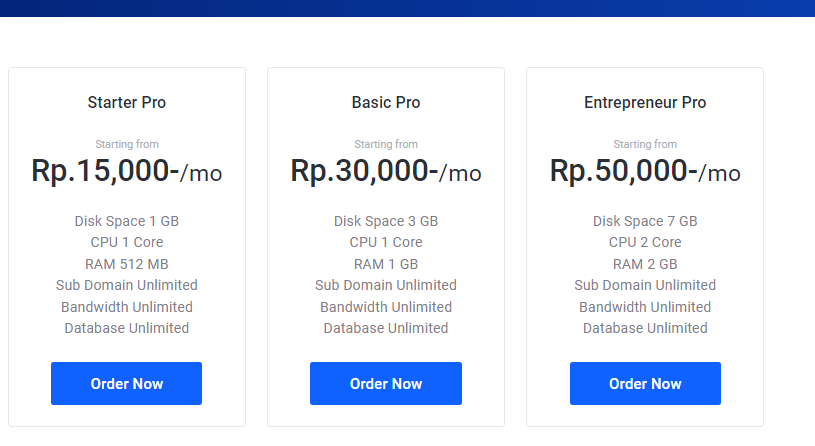
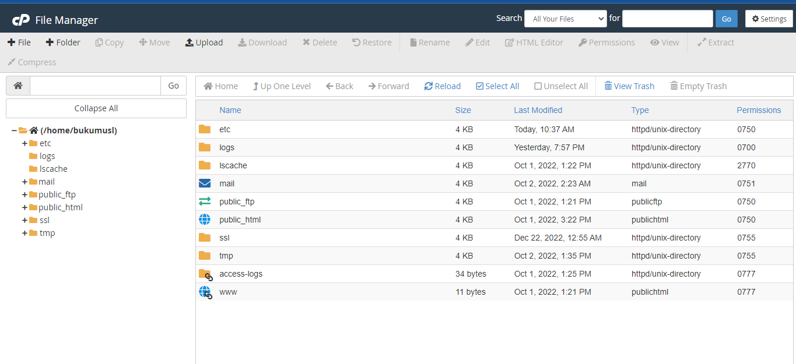

# Cpanel Operation

## Langkah-Langkah Yang Harus Kalian Lakukan Adalah :

### 1. Buat cpanel, saya membelinya seharga 10k di idcloudhost

Berikut adalah link : https://my.idcloudhost.com/

### 2. Lalu Buat Service baru, pilih saja cloud hosting cpanel :

### 3. Pilih Paket

### 4. Konfigurasi Cpanel Anda di File Manager

