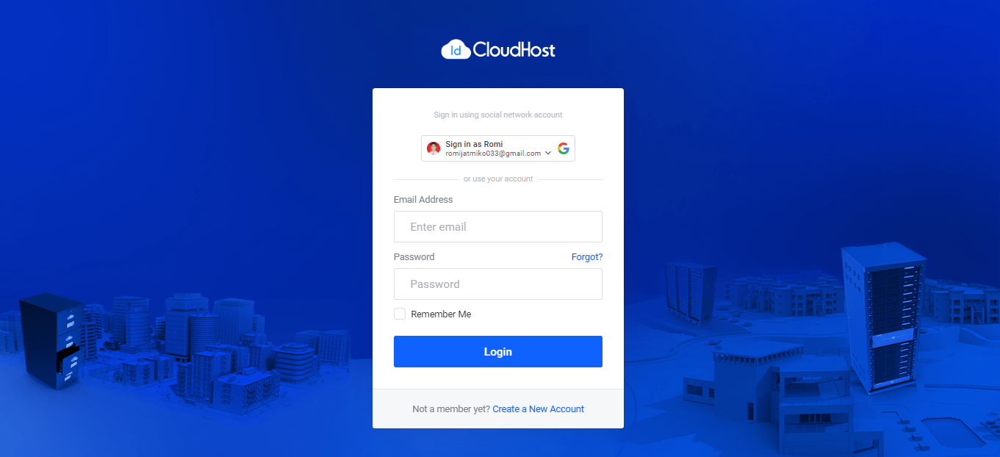
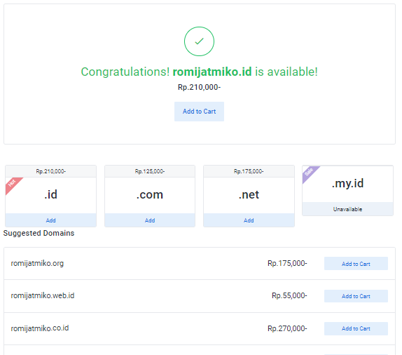
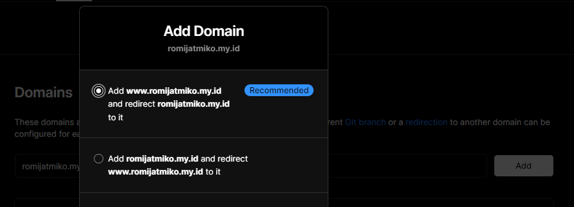
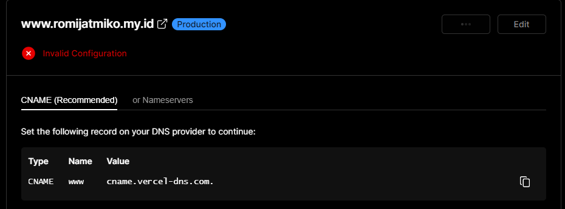
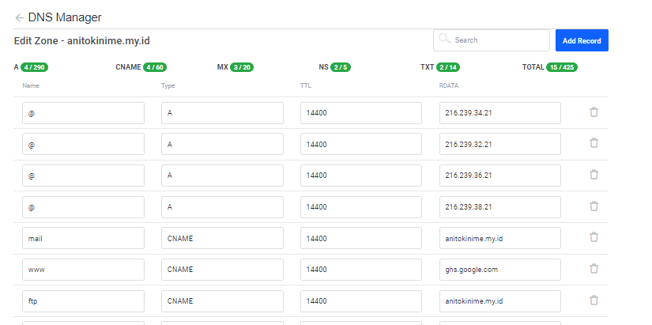

# Domain Registration

## Langkah-Langkah Yang Harus Kalian Lakukan Adalah :

### 1. Register New Domain, Saya Daftar Domain di idcloudhost

Berikut adalah link : https://my.idcloudhost.com/

### 2. Buat domain yang kamu inginkan :

### 3. Setelah itu akan muncul pilihan domain yang tersedia

### 4. Konfigurasi DNS Management dan Nameserver domain kamu, sebagai contoh saya akan menambahkan custom domain untuk project yang saya upload di vercel

--tambahkan domain diproject vercel kamu

--akan muncul config sebagai berikut

--tambahkan config tersebut di dns management domain kamu

--dan tadaaa domain sukses dicustom
