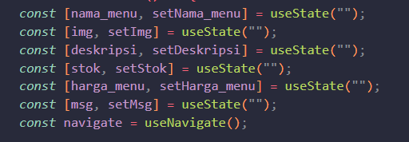
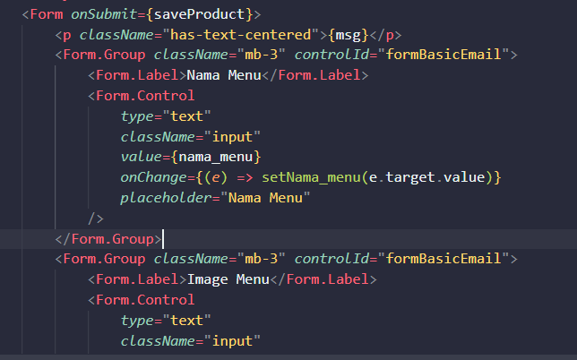
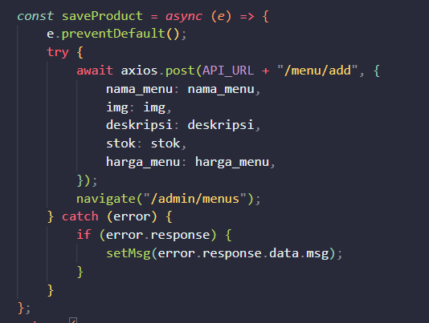
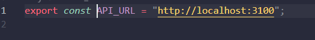
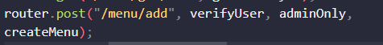
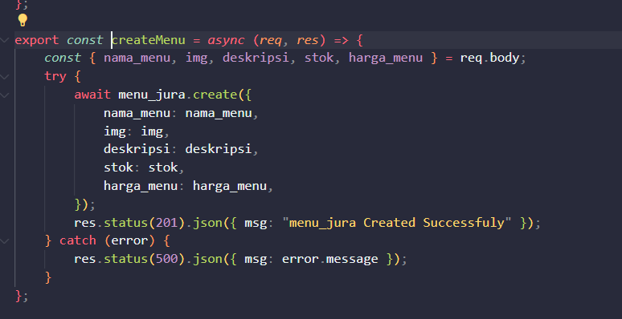
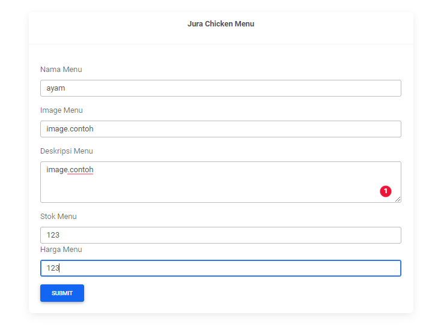
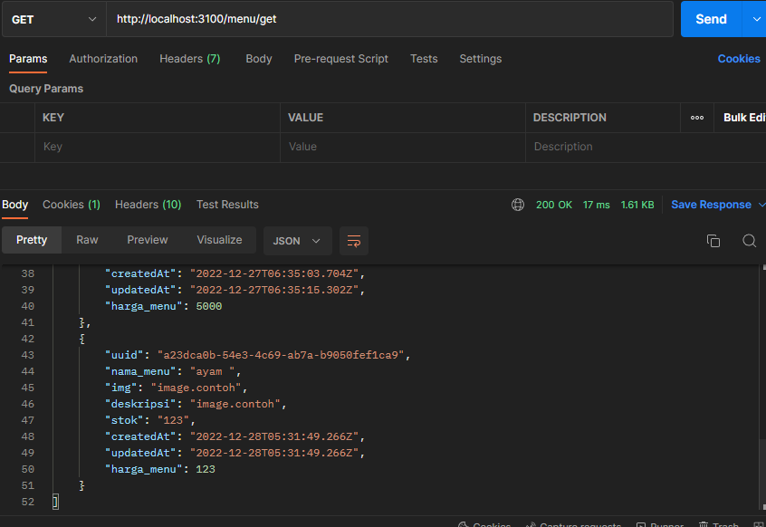

# HTTP GET && POST using Form Action

## Saya Akan Mencontohkan pada saat admin menambah menu

### 1. Buat variable

### 2. Lalu Set Value Form Seperti Berikut, Dengan Button bertipe submit,serta letakan onSubmit di Formnya sengan function SaveProduct

### 2. Berikut Function saveProduct, fungsi ini akan memfetch route : localhost:3100/menu/add

### 3. Berikut isi backend dari rute localhost:3100/menu/add

### 3. Demo Isi Form

### 3. Get Data

