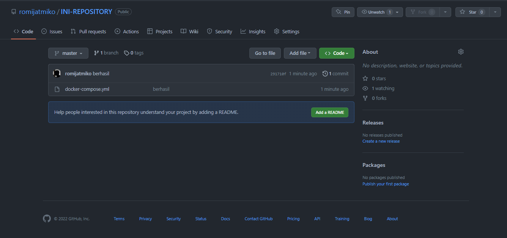

# Git Github Project Init

## Langkah-Langkah Yang Harus Kalian Lakukan Adalah :

### 1. Mendaftar Akun Github

### 2. Buat Repository Baru Dengan Cara Klik New Pada Menu Repository

### 3. Beri Nama Pada Repository Kamu, Dan Buat Repository Sekarang

### 4. Sekarang Waktunya Upload Project Kamu Ke Repository Yang Telah Dibuat

### 5. Saya Akan Mencontohkan Upload Project Lewat VsCode,

Langkah Pertama Yang Harus Dilakukan Adalah Buka Project Kamu Di VSCODE, Sebagai Contoh Saya Akan Mengupload File Docker Ini Ke Repository Yang Telah Saya Buat

### 5. Klik Terminal, Pilih New Terminal

### 5. Pada Terminal Ketikan perintah berikut

-- yang pertama git init

--Lalu git remote add origin (urlrepository)

--contoh
git remote add origin https://github.com/romijatmiko/INI-REPOSITORY.git

--setelah itu click icon git di vscode

--Tambahkan Pesan Commit dan Click Commit

-- Click Publish Branch

-- Dan Tadaaa Project Kamu Sudah Terupload

