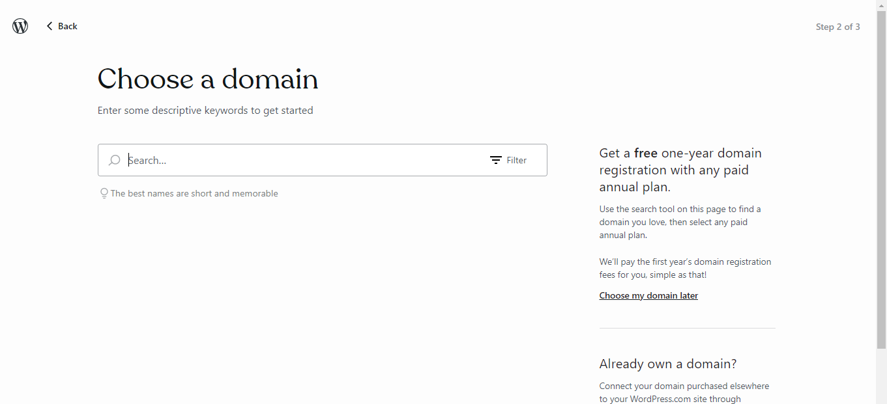
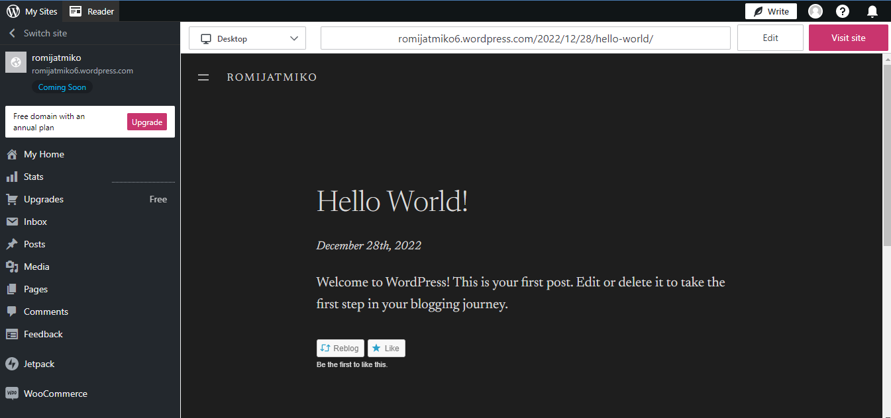
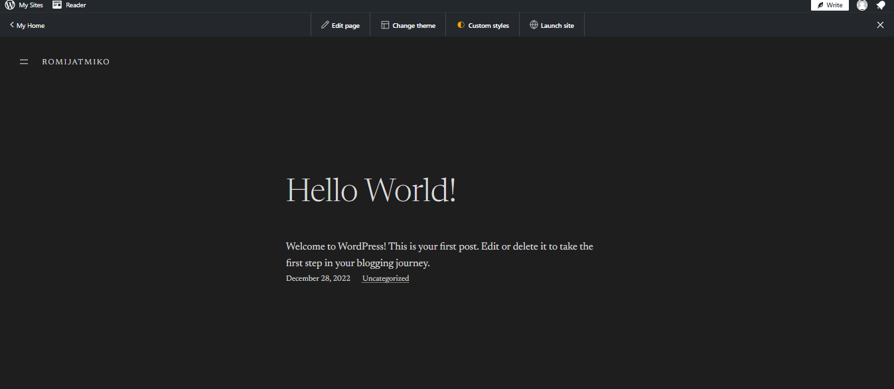

# Wordpress

## Langkah-Langkah Yang Harus Kalian Lakukan Adalah :

### 1. Daftar Akun Wordpress

Berikut adalah link : https://wordpress.com/

### 2. Buat domain untuk blog kamu, pilih saja yang free :

### 3. Setelah setting beberapa settingan

### 4. tadaa blog berhasil terbuat

url blog saya : https://romijatmiko6.wordpress.com/

