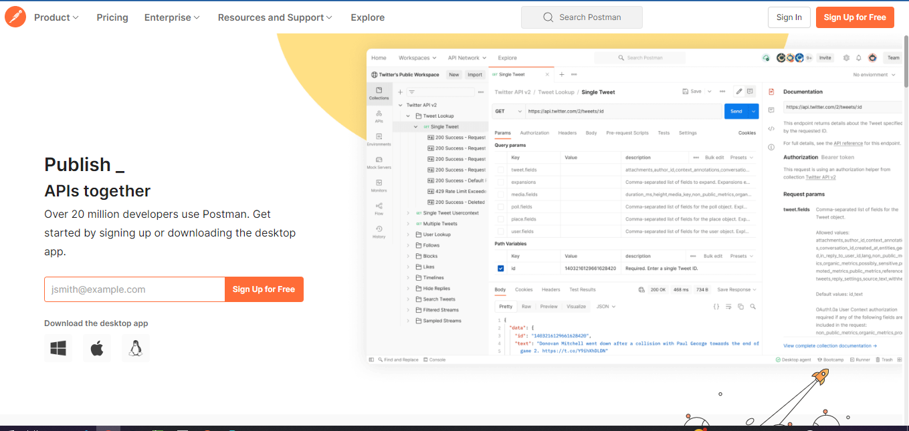
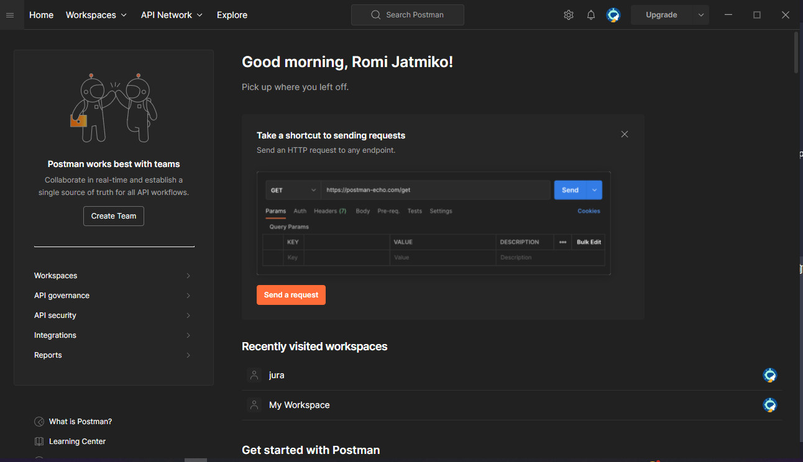
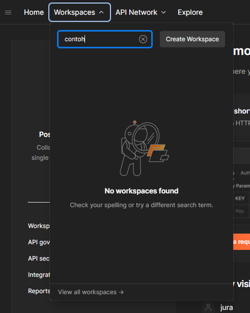
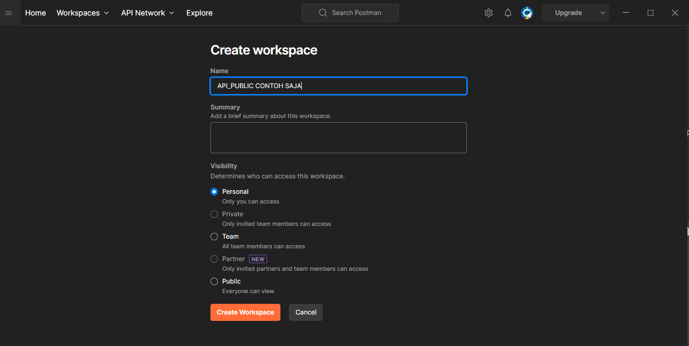
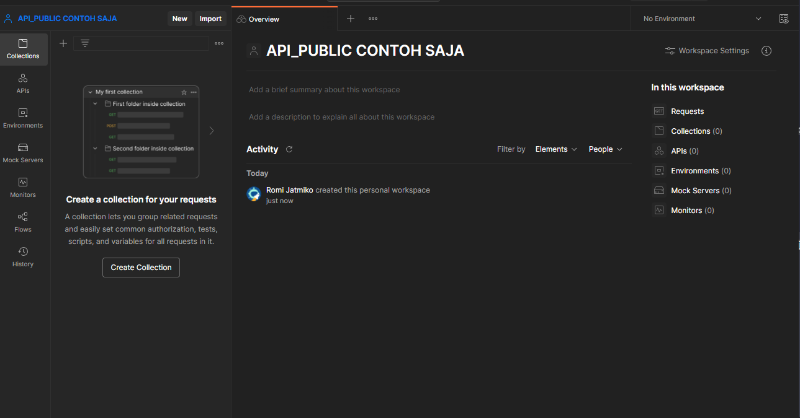
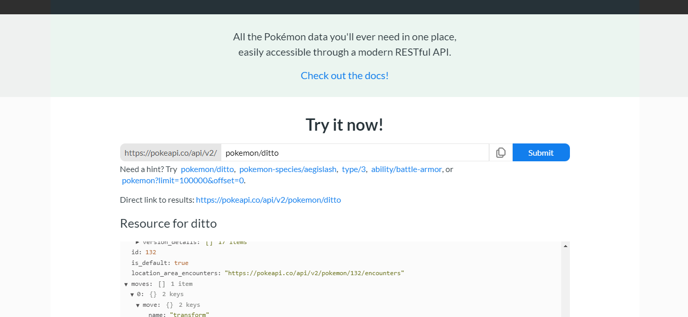
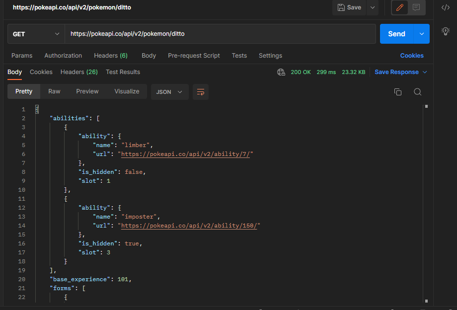

# Postman Acces

## Langkah-Langkah Yang Harus Kalian Lakukan Adalah :

### 1. Kalian Bisa Mendownload Postman Desktop Atau Menggunakannya Di Web Postman

Berikut adalah link postman : https://www.postman.com/

### 2. Untuk Contoh Kali Ini Saya Menggunakan Postman Desktop, Pertama Buka Postmannya dan Akan Menampilakan Tampilan Sebagai Berikut :

### 3. Buat Workspace Baru

### 4. Beri Nama Workspace

### 5. Berikut Tampilan Workspace

### 6. Buat Request Baru

Kita akan mengambil contoh dengan api public pokemon, copy url tersebut :

Lalu letakan di postman request url dengan method get :

### 7. Selamat Kamu Sudah Berhasil
