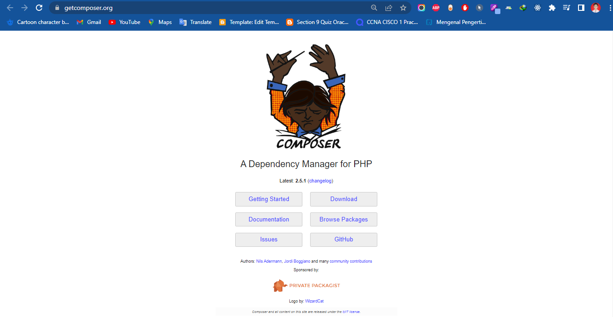

# PHP Composer

## Langkah-Langkah Yang Harus Kalian Lakukan Adalah :

### 1. Download Dan Install PHP Composer

Berikut adalah link postman : https://getcomposer.org/



### 2. Cek Instalasi

dengan cara :

```
$ composer
```

### 3. Buat Project Baru

```
$ mkdir contohPHPHelloworld

$ cd contohPHPHelloworld

$ composer init
```

### 3. Abaikan pengisian Package dengan cara klik enter

### 4. Buat File

```
$ touch helloworld.php
```

### 5. Dalam helloworld.php isi code diabawh :

```
<?php
require_once "vendor/autoload.php";

$hello = new Helloworld\Demo\Hello();
echo $hello->hello();

```

```
$ php helloworld.php
```
