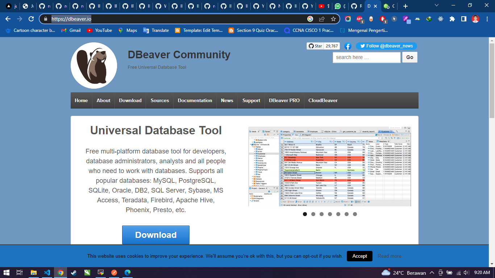
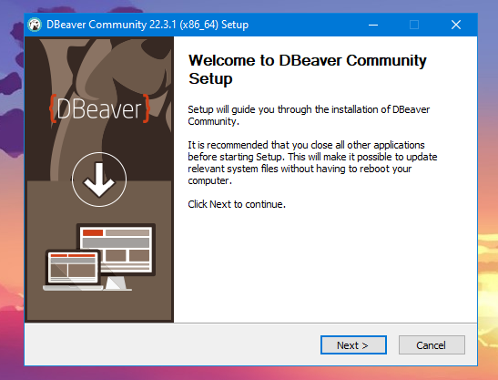
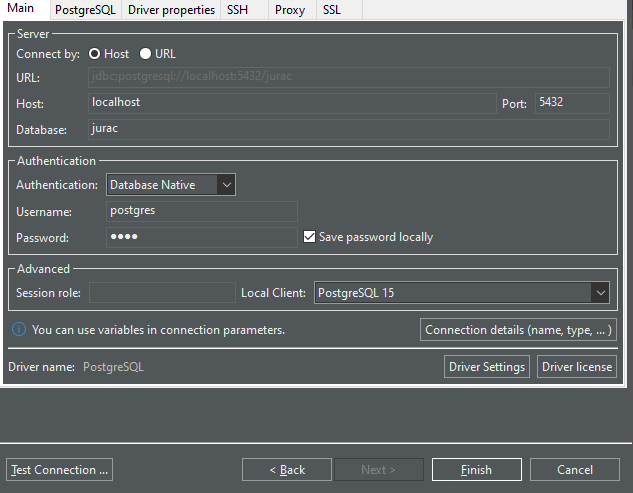
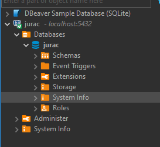
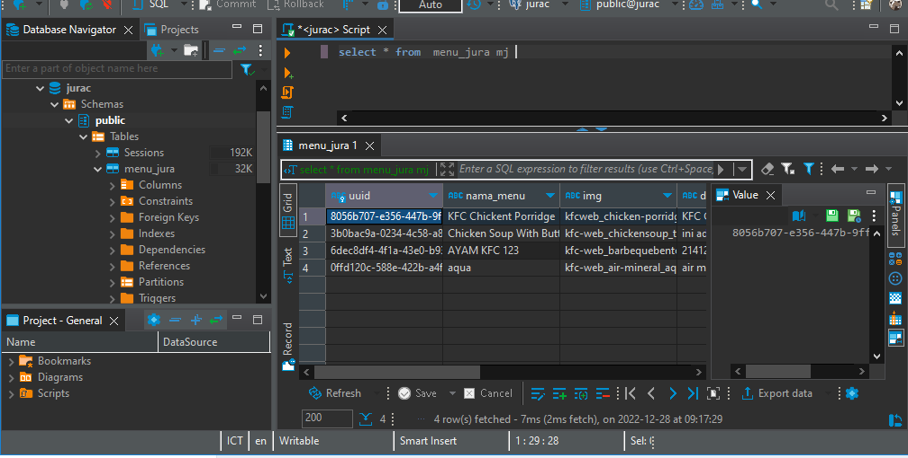

# Dbeaver & PostgreSQL Connection

## Langkah-Langkah Yang Harus Kalian Lakukan Adalah :

### 1. Kalian Bisa Mendownload Dbeaver link dibawah ini

Berikut adalah link debaevr : https://dbeaver.io/

### 2. Install DBeaver Seperti Biasa :

### 3. Tambah Koneksi Lalu Masukan Informasi Database Kalian, Seperti username dan passwordnya

### 3. Jika Koneksi Sukses Akan Tampil Seperti Dibawah Ini

### 3. Kita Test Query DiDBeaver, dan akan tampil seperti dibawah :

