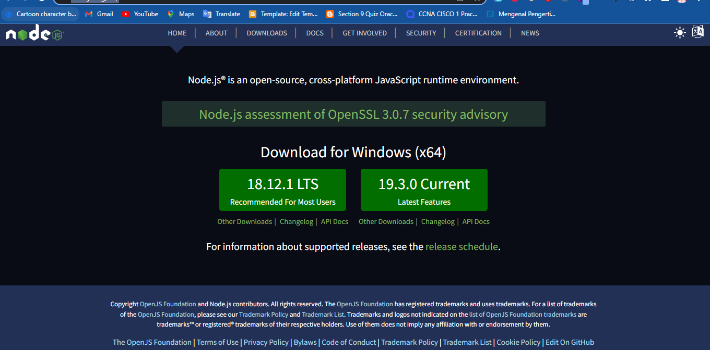
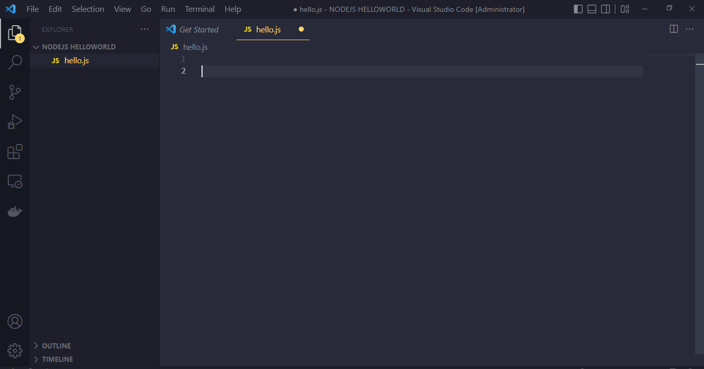
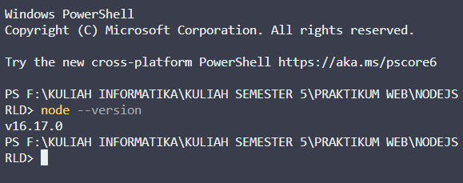
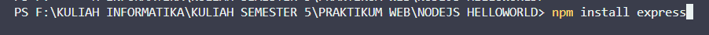
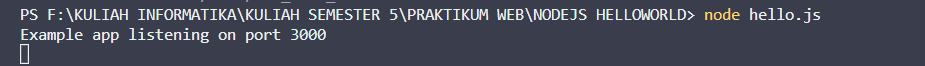
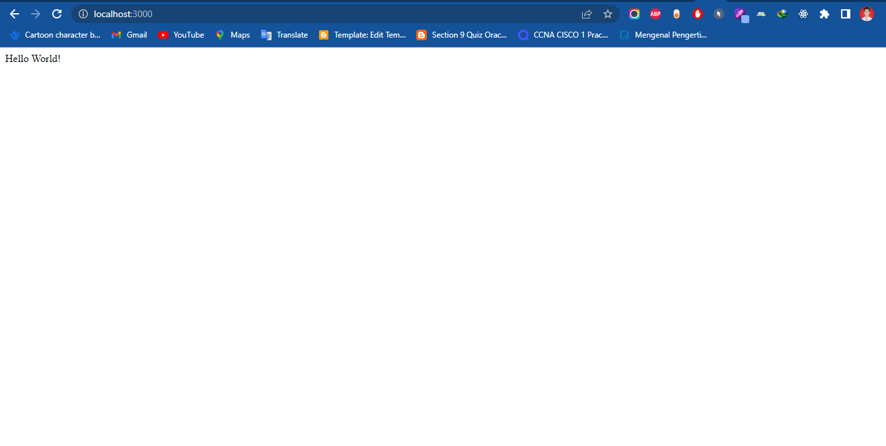

# Node JS NPM Instalation, Hello World

## Langkah-Langkah Yang Harus Kalian Lakukan Adalah :

### 1. Kalian Bisa Mendownload NodeJS link dibawah ini

Berikut adalah link : https://nodejs.org/en/



### 2. Buat Folder Dan File Baru



### 3. Cek NodeJs Apakah Sudah Terinstall



### 3. Install express dengan cara npm i express



### 3. Start Code

```
const express = require("express");
const app = express();
const port = 3000;

app.get("/", (req, res) => {
	res.send("Hello World!");
});

app.listen(port, () => {
	console.log(`Example app listening on port ${port}`);
});


```

### 3. Jalankan Code Dengan Cara node hello.js



### 3. Buka Browser localhost:3000 dan tadaaa, hello world jadi


